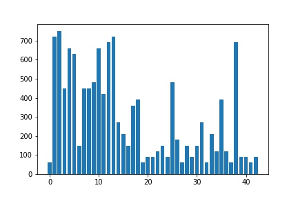
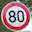

# **Traffic Sign Recognition** 

## Writeup Template

### You can use this file as a template for your writeup if you want to submit it as a markdown file, but feel free to use some other method and submit a pdf if you prefer.

---

**Build a Traffic Sign Recognition Project**

The goals / steps of this project are the following:
* Load the data set (see below for links to the project data set)
* Explore, summarize and visualize the data set
* Design, train and test a model architecture
* Use the model to make predictions on new images
* Analyze the softmax probabilities of the new images
* Summarize the results with a written report

[//]: # (Image References)

[image1]: traffic_sign_distribution.jpg "Visualization"
[image2]: ./examples/grayscale.jpg "Grayscaling"
[image3]: ./examples/random_noise.jpg "Random Noise"
[image4]: ./examples/placeholder.png "Traffic Sign 1"
[image5]: ./examples/placeholder.png "Traffic Sign 2"
[image6]: ./examples/placeholder.png "Traffic Sign 3"
[image7]: ./examples/placeholder.png "Traffic Sign 4"
[image8]: ./examples/placeholder.png "Traffic Sign 5"

## Rubric Points
### Here I will consider the [rubric points](https://review.udacity.com/#!/rubrics/481/view) individually and describe how I addressed each point in my implementation.  

---
### Writeup / README

#### 1. Provide a Writeup / README that includes all the rubric points and how you addressed each one. You can submit your writeup as markdown or pdf. You can use this template as a guide for writing the report. The submission includes the project code.

You're reading it! and here is a link to my [project code](https://github.com/kmertan/CarND-Traffic-Sign-Classifier-Project/blob/master/Traffic_Sign_Classifier.ipynb)

### Data Set Summary & Exploration

#### 1. Provide a basic summary of the data set. In the code, the analysis should be done using python, numpy and/or pandas methods rather than hardcoding results manually.

I used the pandas library to calculate summary statistics of the traffic
signs data set:

* The size of training set is 34799
* The size of the validation set is 4410
* The size of test set is 12630
* The shape of a traffic sign image is 32 x 32 x 3
* The number of unique classes/labels in the data set is 43

#### 2. Include an exploratory visualization of the dataset.

Here is an exploratory visualization of the data set. It is a bar chart showing how the data is distributed across each of the 43 classifications. There classes are highly unbalanced in some cases.

### Design and Test a Model Architecture

#### 1. Describe how you preprocessed the image data. What techniques were chosen and why did you choose these techniques? Consider including images showing the output of each preprocessing technique. Pre-processing refers to techniques such as converting to grayscale, normalization, etc. (OPTIONAL: As described in the "Stand Out Suggestions" part of the rubric, if you generated additional data for training, describe why you decided to generate additional data, how you generated the data, and provide example images of the additional data. Then describe the characteristics of the augmented training set like number of images in the set, number of images for each class, etc.)

I first normalized the images by subtracting 128.0 from each pixel, then dividing by 128.0 for a roughly 0 mean and standard deviation of 1.

Initially, I converted each image to grayscale. After some research, I decided to keep my normalized 3 channel image and add a 1x1 convolutional layer from the get go. I saw this as a way for the model to determine it's own ideal filter in a way. Since the output dimensions of this layer are the same as the input image, it can "learn" this filter like other parameters without losing information by reducing three channels to one, as is the case with grayscale images.

#### 2. Describe what your final model architecture looks like including model type, layers, layer sizes, connectivity, etc.) Consider including a diagram and/or table describing the final model.

My final model consisted of the following layers:

| Layer         		|     Description	        					| 
|:---------------------:|:---------------------------------------------:| 
| Input         		| 32x32x3 Normalized image   							| 
| Convolution 1x1		| 1x1 stride, same padding, outputs 32x32x3
| Convolution 5x5     	| 1x1 stride, valid padding, outputs 28x28x6 	|
| RELU					|												|
| Max pooling	      	| 2x2 stride,  outputs 14x14x6 				|
| Convolution 5x5	    | 1x1 stride, valid padding, outputs 10x10x6      									|
| RELU					|												|
| Max pooling	      	| 2x2 stride,  outputs 5x5x6 				|
| Flattening      		| Flattens data to 400 features 				|
| Fully connected		| xW + b, outputs 120    									|
| RELU		|     									|
| Dropout		| 50% keep probability    									|
| Fully connected		| xW + b, outputs 43    									|
| RELU		|     									|
| Dropout		| 50% keep probability    									|
| Softmax			      	| xW + b, outputs probabilities for each class				

#### 3. Describe how you trained your model. The discussion can include the type of optimizer, the batch size, number of epochs and any hyperparameters such as learning rate.

To train the model, I used an Adam optimizer. I used 20 epochs with a batch size of 16. I noticed stabilization after about 15 epochs and let my model run to twenty for good measure. The batch size increased my validation accuracy when dropping from 128 to 64, then again to 32, with only a minor increase when going to 16.

My learning rate of .0005 was half that of the LeNet learning rate that was provided. The original .001 rate had high variance in later epochs, but this new rate allowed for a smoother convergence.

My probability of keeping nodes was 50% for both of my dropout layers which increased my validation accuracy with each one added. I did not notice significantly higher validation accuracy with a keep probability of 60%, 70% or 80%.

#### 4. Describe the approach taken for finding a solution and getting the validation set accuracy to be at least 0.93. Include in the discussion the results on the training, validation and test sets and where in the code these were calculated. Your approach may have been an iterative process, in which case, outline the steps you took to get to the final solution and why you chose those steps. Perhaps your solution involved an already well known implementation or architecture. In this case, discuss why you think the architecture is suitable for the current problem.

My final model results were:

* training set accuracy of 99.3%
* validation set accuracy of 96.0% 
* test set accuracy of 93.7%

If an iterative approach was chosen:

* What was the first architecture that was tried and why was it chosen?
The first model I ran was vanilla LeNet, modified for a 32x32x3 input image. This is the model we began with and obviously performed decently given these images.

* What were some problems with the initial architecture?
The model did not meet the 93% minimum validation accuracy because it was not tuned for this particular dataset.

* How was the architecture adjusted and why was it adjusted? Typical adjustments could include choosing a different model architecture, adding or taking away layers (pooling, dropout, convolution, etc), using an activation function or changing the activation function. One common justification for adjusting an architecture would be due to overfitting or underfitting. A high accuracy on the training set but low accuracy on the validation set indicates over fitting; a low accuracy on both sets indicates under fitting.
I added a single 1x1 convolutional layer after the input and a dropout layer after each of the fully connected layers. The 1x1 layer was implemented as my idea of a "filter", as described above. The two dropout layers were to prevent over fitting. Both of them increased validation accuracy.

* Which parameters were tuned? How were they adjusted and why?
I tuned the batch size, number of epochs and learning rate. The batch size actually increased my accuracy significantly when dropping from the initial 128. The number of epochs was increased to help the model converge, as I felt accuracy wasn't finished increasing with just 10. The learning rate was a bit too high at .001. Epochs toward the end fluctuated greatly, telling me I needed smaller steps in my training.

* What are some of the important design choices and why were they chosen? For example, why might a convolution layer work well with this problem? How might a dropout layer help with creating a successful model?
I think the dropout layers were important to differentiate signs like 30 km/h vs. 80 km/h. They have very similar features, and the model may have seen the right side of the "8" as a "3". Using dropout doesn't allow the model to get caught up on a detail that the two might share, as it loses nodes at random with each run.
 

### Test a Model on New Images

#### 1. Choose five German traffic signs found on the web and provide them in the report. For each image, discuss what quality or qualities might be difficult to classify.

Here are five German traffic signs that I found on the web:

   
 

#### 2. Discuss the model's predictions on these new traffic signs and compare the results to predicting on the test set. At a minimum, discuss what the predictions were, the accuracy on these new predictions, and compare the accuracy to the accuracy on the test set (OPTIONAL: Discuss the results in more detail as described in the "Stand Out Suggestions" part of the rubric).

Here are the results of the prediction:

| Image			        |     Prediction	        					| 
|:---------------------:|:---------------------------------------------:| 
| Class 5: Speed limit (80km/h)  	| End of Speed limit (80km/h)   									| 
| Class 15: No Vehicles 			| No Vehicles 										|
| Class 12: Priority Road			| Priority Road											|
| Class 14: Stop		      		| Stop					 				|
| Class 13: Yield					| Yield      							|

The model was able to correctly guess 4 of the 5 traffic signs, which gives an accuracy of 80%. This compares favorably to the accuracy on the test set of 93.7%

#### 3. Describe how certain the model is when predicting on each of the five new images by looking at the softmax probabilities for each prediction. Provide the top 5 softmax probabilities for each image along with the sign type of each probability. (OPTIONAL: as described in the "Stand Out Suggestions" part of the rubric, visualizations can also be provided such as bar charts)

The code for making predictions on my final model is located in the 15th cell of the Ipython notebook.

My first image is the only incorrectly classified one. The image is thought to be an End Of 80 km/h zone. This is a normal 80 km/h sign, not an "End Of". This is an understandable mix up, but could be costly in reality.

| Probability         	|     Prediction	        					| 
|:---------------------:|:---------------------------------------------:| 
| .89         			| End of speed limit (80km/h)   									| 
| .10     				| Speed Limit (80km/h)										|
| .003					| Speed limit (60km/h)										|
| .0007	      			| End of all speed and passing limits					 				|
| .0001				    | Stop      							|

For the second image, my model correctly identifies a No Vehicles sign. This is a close one for the model though, as it is only 38% confident in its classification, with a 26% confidence for its second choice.

| Probability         	|     Prediction	        					| 
|:---------------------:|:---------------------------------------------:| 
| .38         			| No vehicles   									| 
| .26     				| Priority road 										|
| .25					| Speed limit (120km/h)											|
| .04	      			| Speed limit (80km/h)					 				|
| .01				    | Keep right      							|

For the third through fifth image, my model was extremely confident in its classifications. Each of the last three were correct with nearly 100% confidence in their classifications.

| Probability         	|     Prediction	        					| 
|:---------------------:|:---------------------------------------------:| 
| 1.0         			| Priority road   									| 
| .00     				| Yield 										|
| .00					| End of no passing											|
| .00	      			| Speed limit (100km/h)					 				|
| .00				    | Speed limit (120km/h)      							|

For the fourth image ... 

| Probability         	|     Prediction	        					| 
|:---------------------:|:---------------------------------------------:| 
| 1.0         			| Stop   									| 
| .00     				| Yield 										|
| .00					| Speed limit (30km/h)											|
| .00	      			| No entry					 				|
| .00				    | Priority road      							|

For the fifth image ... 

| Probability         	|     Prediction	        					| 
|:---------------------:|:---------------------------------------------:| 
| 1.0         			| Yield   									| 
| .00     				| Ahead only 										|
| .00					| Speed limit (60km/h)											|
| .00	      			| Road work					 				|
| .00				    | No passing      							|

### (Optional) Visualizing the Neural Network (See Step 4 of the Ipython notebook for more details)
#### 1. Discuss the visual output of your trained network's feature maps. What characteristics did the neural network use to make classifications?

